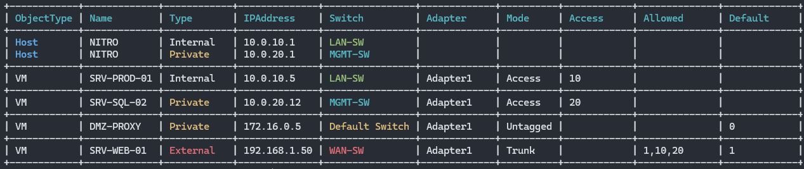

<p align="center">
  
</p>

# Hyper-V VLAN Reporting Tool

A PowerShell utility that generates a color-coded ASCII report of Hyper-V network configurations. Perfect for quick audits of VLAN assignments across VMs and Host adapters.

## 🚀 Key Features
- **Visual Color-Coding:** Instantly differentiate between External (Red), Internal (Gray), and Private (Yellow) switches.
- **VLAN Identification:** Clearly shows Access vs. Trunk modes and native/allowed VLAN IDs.
- **IP Discovery:** Pulls the primary IPv4 address for both VMs and Host adapters.
- **Smart Sorting:** Groups objects by Host vs. VM and sorts by VLAN ID for easy auditing.

## 🛠️ How to Use

### Real Environment
Run the script on a Hyper-V Host:
```powershell
Set-ExecutionPolicy RemoteSigned -Scope CurrentUser
.\Get-HyperV-VLANReport.ps1